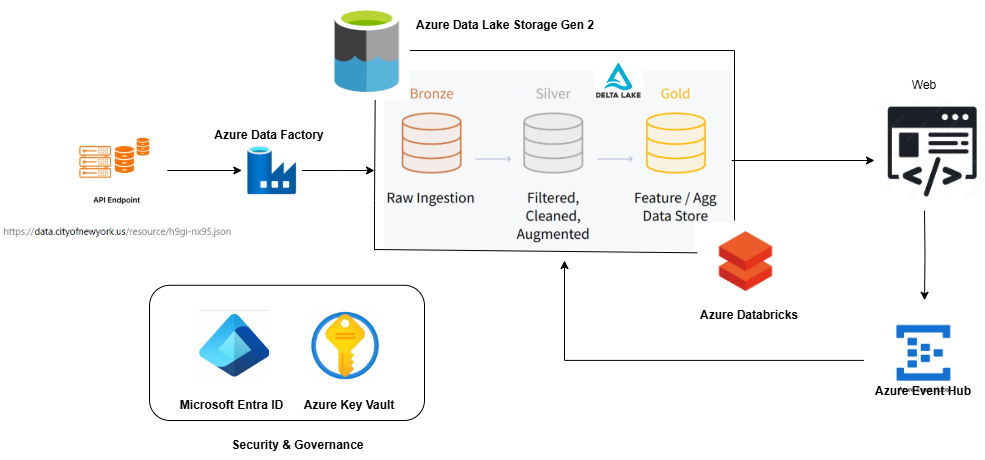
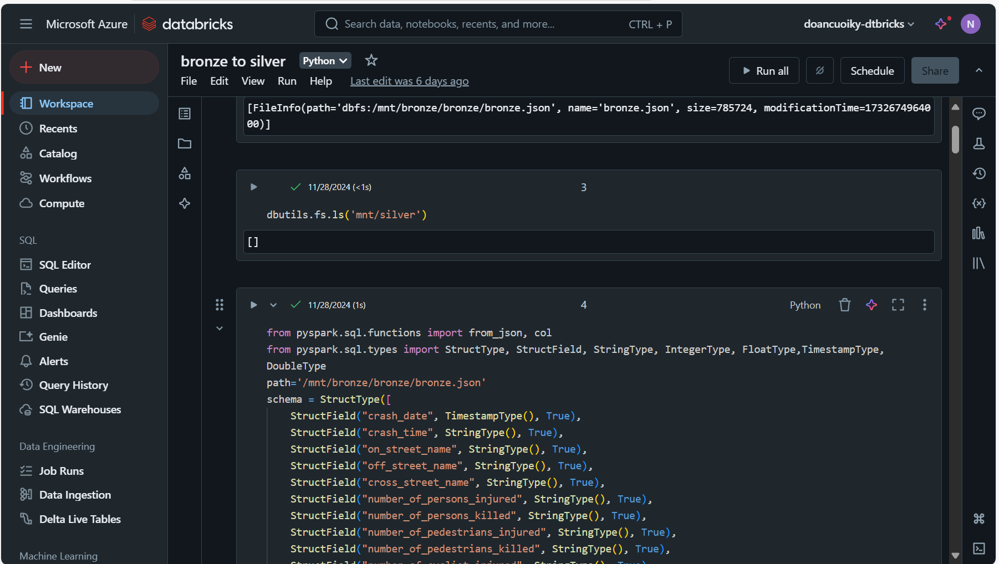
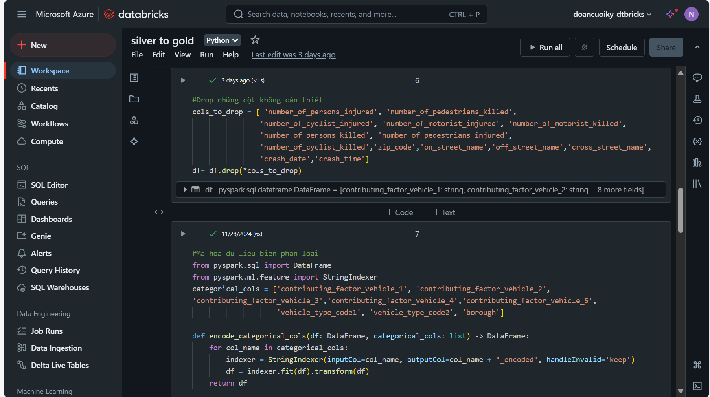
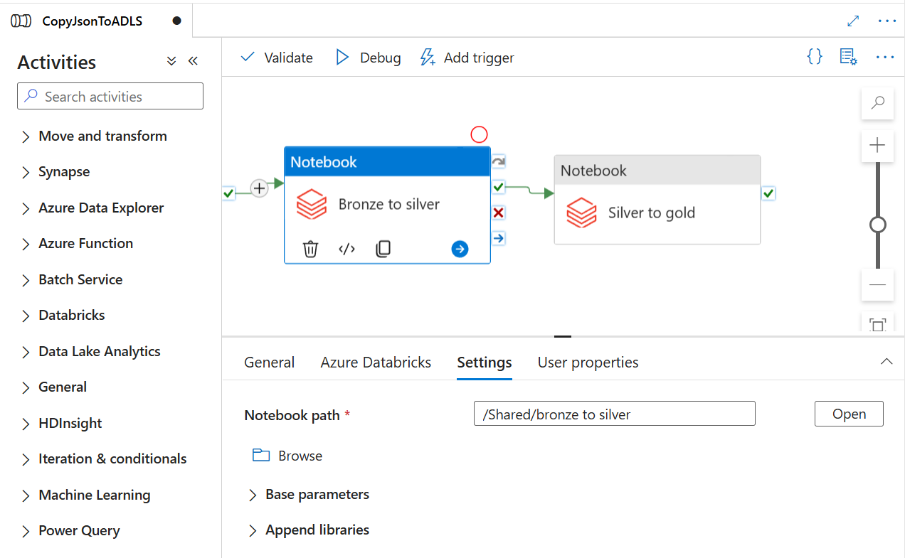
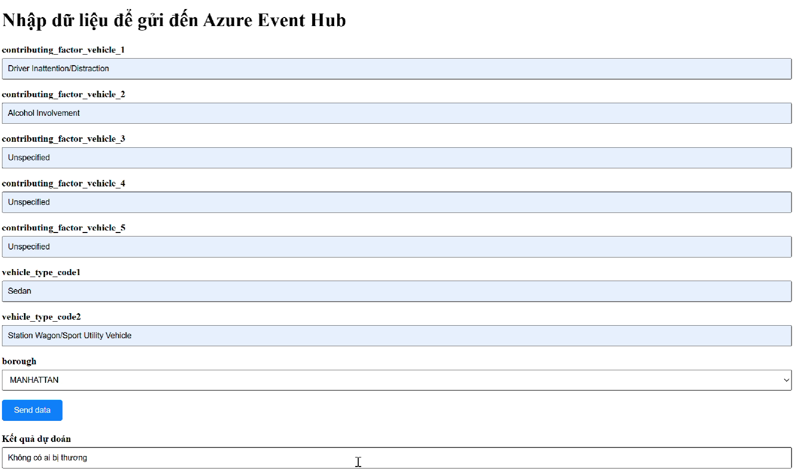

# Azure-ELT-for-Crashes-prediction
This repository shows how data is extracted from an API via Azure Data Factory pipeline. Processed data is consumed via web apps or Azure Event Hub

## About data
The government of New York State collects information about traffic accidents occurring across the counties of the state to analyze and implement measures to reduce the likelihood of accidents and casualties on New York's roads. Every day, hundreds to thousands of accidents are recorded within the state's jurisdiction, with information being collected from various sources.

To address this issue, a robust, flexible, and automated data processing system is required to collect, standardize, and analyze data from multiple sources, with the goal of implementing measures to reduce traffic accidents.
## Data Flow Diagram

Below is the explanation of the process:
1. Data Source:

Data is initially fetched from an API endpoint (https://data.cityofnewyork.us/resource/h9gi-nx95.json), which provides JSON files containing raw accident data.

2. Azure Data Factory:

Azure Data Factory (ADF) is used as the ETL (Extract, Transform, Load) tool to ingest data from the API and process it. It handles raw ingestion and prepares the data for further processing and storage in Azure Data Lake.

3. Azure Data Lake Storage Gen 2 (ADLS):

Data is stored in Azure Data Lake following the Delta Lake architecture, divided into three layers:
Bronze Layer: Stores raw ingested accident data.
Silver Layer: Contains filtered and cleaned data, prepared for analysis.
Gold Layer: Holds feature-engineered and aggregated data, ready for machine learning or direct consumption.

4. Azure Databricks:

Azure Databricks is used to process and transform data from the Silver layer.
A machine learning model is trained on historical accident data to predict whether a new accident is likely to involve injuries or not. The model is deployed and used for real-time predictions.

5. Web Applications:

New traffic accident data is sent to the pipeline through the Web Application.
The application sends raw accident data to Azure Event Hub, which acts as the message broker.

6. Azure Event Hub:

Event Hub receives real-time raw data from the Web Application and forwards it to Azure Data Lake for storage in the Bronze Layer.
The same data is also routed to Azure Databricks, where the trained machine learning model processes it and generates a prediction.

7. Security & Governance:

Microsoft Entra ID (Azure Active Directory) and Azure Key Vault ensure secure access to resources and handle sensitive credentials such as API keys, Databricks Access token and secrets.
###### Summary:
This pipeline automates the ingestion, processing, and prediction of traffic accident data. 
## Implementation system
###### The processing flow of transferring data from API endpoints to Azure Data Lake Storage Gen2

###### Process and move data from the Bronze layer to the Silver layer in ADLS2

###### Process and move data from the Silver layer to the Gold layer in ADLS2

###### Create a pipeline from notebooks in Azure Data Factory

###### Develop a web page using the model's API: send requests to the cloud system, receive responses, and parse the results

## Technologies used: 
Azure Technologies used: Azure Data Factory, Azure Data Lake Storage Gen 2, Azure Databricks, Azure Databricks, Azure Event Hub, Microsoft Entra ID, Azure Key Vault

Others: PySpark, Python, HTML, CSS

